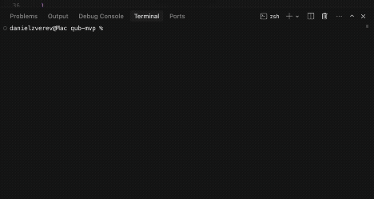

# BlackCube Security

Security linting for AI-generated code. Ship fast, catch exposed secrets and common vulnerabilities before they reach production. Published to npm as `blackcube` (v1.0.6).

## Why

AI coders accelerate delivery but frequently miss security fundamentals. BlackCube scans repositories, git history, and dependencies to surface high-impact issues in seconds.

## Installation & Usage

```bash
# Basic scan (auto-scans current repo)
npx blackcube scan

# Scan a specific directory
npx blackcube scan ./path/to/repo

# JSON output for CI/CD
npx blackcube scan --json

# Skip git history (faster)
npx blackcube scan --skip-history

# Only show selected severity
npx blackcube scan --severity high

# Verbose mode with code snippets
npx blackcube scan --verbose

# Legacy alias (if already installed locally)
npx blackcube-security scan
```

## Demo



_The demo shows how the secuirty linter works._

## What BlackCube Checks

- Exposed secrets: AWS keys, API keys, OAuth tokens, JWT secrets, Stripe keys, GitHub tokens, DB creds, private key blocks
- Sensitive files not ignored: `.env`, `.env.local`, config files
- Git history leaks: secrets committed in the last N commits (default 100)
- Code vulnerabilities: SQL injection concatenation, innerHTML/dangerouslySetInnerHTML XSS sinks, eval/Function constructors, weak crypto (md5/sha1), hardcoded credentials
- Dependency red flags: event-stream, vulnerable minimist/lodash versions, unpinned dependencies
- Binary/large files are skipped automatically

## Example Output

```
[ BLACKCUBE ] security scan
────────────────────────────────────────────────
CRITICAL 03  HIGH 02  MEDIUM 01  LOW 00
┌ stats ────────────────────────────────────────
│ files       248 scanned (3 skipped)
│ history     scanned
│ duration    4200ms
└───────────────────────────────────────────────

[!!] CRITICAL (3 issues)
  • Exposed AWS Secret Key
    File: src/config.js:12
    Pattern: AWS_SECRET_ACCESS_KEY="AKIAI..."
    Fix: Move to .env, add .env to .gitignore, rotate key immediately

[! ] HIGH (2 issues)
  • .env file not in .gitignore
    File: .env
    Fix: Add .env to .gitignore immediately

[- ] MEDIUM (1 issue)
  • Potential SQL injection
    File: api/users.js:45
    Code: SELECT * FROM users WHERE id = ${req.params.id}
    Fix: Use parameterized queries

Summary: 6 issues found | critical 3 | high 2 | medium 1 | low 0
```

## Common Fixes

- Secrets: move to environment variables or secret manager; add env files to `.gitignore`; rotate exposed credentials
- Git history leaks: use `git filter-repo` (or `git filter-branch`) to purge, then rotate
- SQL injection: use parameterized queries/prepared statements
- XSS sinks: prefer `textContent`, sanitize any HTML, avoid `dangerouslySetInnerHTML`
- Weak crypto: avoid `md5`/`sha1` for passwords; use bcrypt/scrypt/argon2
- Hardcoded credentials: remove from code, pull from secure config
- Dependencies: upgrade vulnerable versions; pin to known-good releases

## CI/CD Integration

```yaml
# .github/workflows/security.yml
name: security-scan
on: [push, pull_request]

jobs:
  blackcube:
    runs-on: ubuntu-latest
    steps:
      - uses: actions/checkout@v4
      - uses: actions/setup-node@v4
        with:
          node-version: "20"
      - run: npx blackcube scan --json
```

Exit codes:

- `0` no issues
- `1` only low/medium issues
- `2` high/critical issues present

## Contributing

- Open an issue describing the vulnerability pattern or secret type you want added.
- Fork, branch, and submit a PR with tests or reproduction snippets.
- Keep performance in mind: prefer streaming, avoid loading huge files, respect `.gitignore`.

## License

MIT License. See [LICENSE](./LICENSE).
